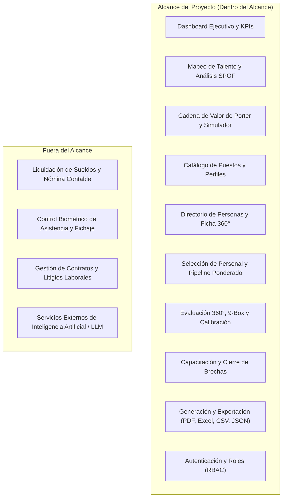
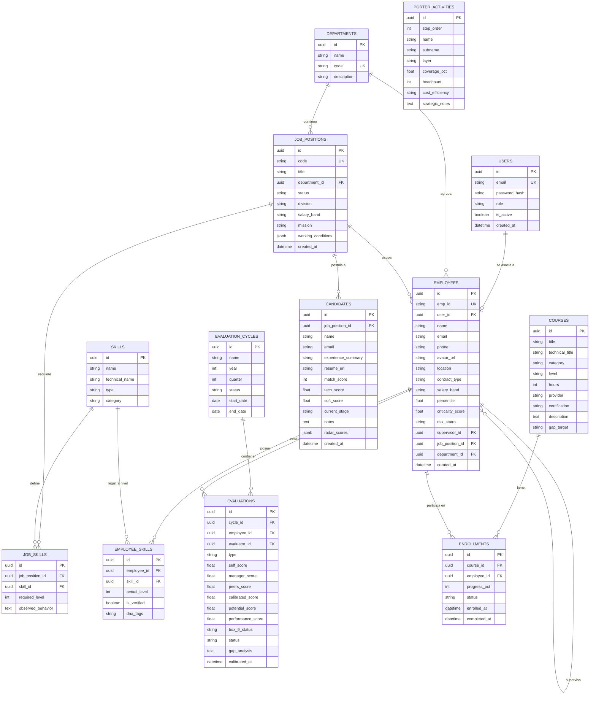
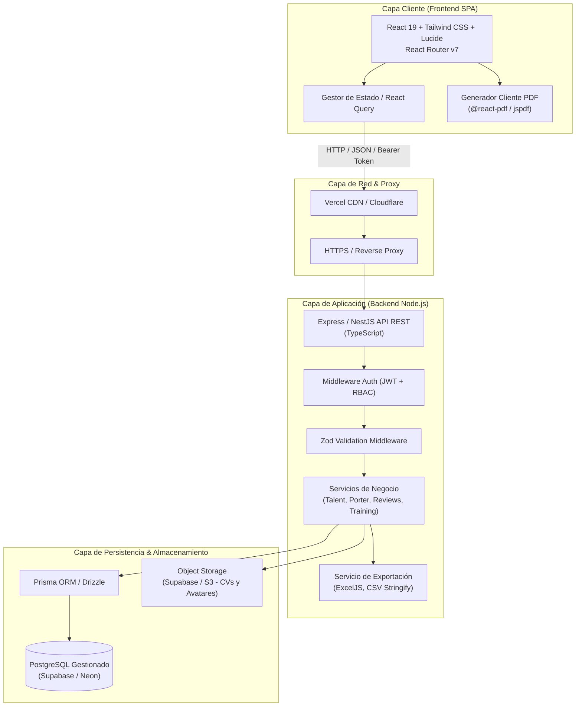

# NEXUS · Plataforma Integral de Inteligencia de Capital Humano y People Analytics
## Documento de Especificación de Requerimientos y Diseño Funcional (SRS)

---

### Control del Documento
* **Proyecto:** TFI - NEXUS (Trabajo Final Integrador)
* **Versión:** 1.1.0 (Sin servicios de IA externa; Requerimientos de Exportación PDF/CSV/Excel formalizados)
* **Fecha:** Octubre 2026
* **Estado:** Aprobado para Diseño de Backend y Base de Datos

---

## 1. Introducción y Propósito

### 1.1 Propósito
El presente documento define la especificación formal de requerimientos funcionales, requerimientos no funcionales, alcance, arquitectura conceptual, especificación de exportación de documentos (PDF, Excel, CSV, JSON) y modelo de datos para el desarrollo del backend, base de datos y despliegue integral de la plataforma **NEXUS**.

### 1.2 Problema de Negocio
Las organizaciones tecnológicas y de ingeniería sufren frecuentemente de:
* **Falta de visibilidad sobre habilidades críticas:** Desconocimiento de qué colaboradores dominan tecnologías clave y cuáles representan un punto único de falla (**SPOF - Single Point of Failure**).
* **Desconexión entre la estrategia corporativa y el talento:** Los puestos de trabajo y las evaluaciones no están vinculados a la cadena de valor que genera ingresos o rentabilidad.
* **Procesos de selección y capacitación aislados:** Los planes de formación no resuelven las brechas reales identificadas en las evaluaciones de desempeño, y los procesos de reclutamiento no cuentan con métricas objetivas de compatibilidad (*match score*).
* **Dificultad para documentar y auditar:** Falta de reportes ejecutivos exportables y legajos imprimibles para comités directivos y auditorías de talento.

---

## 2. Objetivos del Sistema

### 2.1 Objetivo General
Desarrollar e implementar una plataforma web integral de gestión del talento humano y People Analytics que permita modelar la cadena de valor empresarial, cartografiar las competencias del personal mediante algoritmos propios, evaluar el desempeño multidimensionalmente (matriz 9-Box), gestionar el reclutamiento predictivo por afinidad, automatizar planes de capacitación para cierre de brechas y generar reportes ejecutivos en formatos descargables estándar (PDF, Excel, CSV).

### 2.2 Objetivos Específicos
1. **Modelar la estructura organizacional y de valor:** Representar visualmente las actividades primarias y de apoyo de la organización (modelo de Michael Porter) y cuantificar el impacto y cobertura de los puestos de trabajo.
2. **Gestionar perfiles y competencias 360°:** Mantener un catálogo estandarizado de puestos y fichas de colaboradores con métricas de adecuación al puesto (*role match*), competencias técnicas y blandas, y detección de criticidad operativa.
3. **Optimizar el proceso de selección de personal:** Proporcionar un pipeline de reclutamiento con evaluación de candidatos mediante un algoritmo ponderado de afinidad y radar de competencias.
4. **Instrumentar ciclos formales de evaluación y calibración:** Gestionar evaluaciones multifuente (autoevaluación, líder y pares), clasificar el talento en la matriz 9-Box (potencial vs. desempeño) y registrar acuerdos de comité de calibración.
5. **Cerrar brechas mediante capacitación guiada:** Vincular automáticamente los déficits de habilidades observados en los colaboradores con programas de upskilling pertinentes.
6. **Centralizar la exportación documental:** Proveer generación y descarga directa de informes ejecutivos en PDF, matrices de puestos en Excel/CSV, legajos 360° en PDF y planes formativos descargables.

---

## 3. Alcance del Proyecto

### 3.1 Dentro del Alcance (In Scope)
* **Módulo de Panorama Ejecutivo:** Tablero de comando con KPIs consolidados en tiempo real.
* **Módulo de Mapeo de Talento:** Visualización en red/grafo y flujo del talento, criticidad y análisis de riesgo SPOF.
* **Módulo de Cadena de Valor:** Asignación de colaboradores y puestos a eslabones de valor, métricas de eficiencia de costos y simulador de impacto en headcount/presupuesto.
* **Módulo de Puestos:** Catálogo de cargos, misiones, relaciones formales, condiciones de trabajo y requerimientos de competencias con niveles y conductas observables.
* **Módulo de Colaboradores:** Ficha integral del personal, análisis de brecha (*gap analysis*), historial de revisiones y enrolamiento en capacitaciones.
* **Módulo de Selección:** Pipeline por etapas (*Screening*, Técnica, Cultural, Oferta), cálculo de score de afinidad ponderado y emisión de ofertas de empleo.
* **Módulo de Desempeño:** Flujo de evaluación 360°, matriz 9-Box, comités de calibración y ajustes de puntuación.
* **Módulo de Capacitación:** Itinerarios formativos vinculados a brechas específicas, control de inscriptos y tasa de completitud.
* **Módulo de Generación Documental y Reportes:** Generación y descarga real de reportes en PDF, matrices tabulares en Excel (`.xlsx`) y CSV, fichas individuales en PDF y datasets en JSON.
* **Backend y Base de Datos:** API REST segura, persistencia relacional en PostgreSQL y almacenamiento de archivos.
* **Seguridad:** Autenticación por tokens JWT y autorización basada en roles (RBAC).
* **Despliegue:** Frontend en Vercel, Backend en Render/Railway y Base de Datos en la nube (Supabase/Neon).

### 3.2 Fuera del Alcance (Out of Scope)
* Servicios externos de Inteligencia Artificial (Google Gemini, OpenAI u otros LLMs). Todo el matching, ponderación y cálculo se realiza mediante algoritmos y reglas del sistema.
* Módulo contable de liquidación y depósito bancario de haberes (Payroll).
* Control de reloj biométrico o fichaje de horarios de entrada/salida física.
* Gestión documental de juicios o litigios laborales.

---

## 4. Actores del Sistema y Matriz de Roles (RBAC)

| Rol | Código | Descripción | Permisos Principales |
| :--- | :--- | :--- | :--- |
| **Administrador de RRHH** | `ADMIN_HR` | Responsable del área de Talento y People Analytics. | Acceso total: CRUD de puestos, personas, configuración de ciclos de evaluación, calibración, exportación de todos los reportes, ofertas de empleo. |
| **Líder de Área / Manager** | `MANAGER` | Supervisores, directores de ingeniería o líderes de squads. | Ver fichas de sus reportes directos, evaluar a su equipo en el ciclo 360°, descargar fichas de su equipo, revisar candidatos asignados y sugerir capacitaciones. |
| **Colaborador / Empleado** | `EMPLOYEE` | Miembro del personal de la organización. | Ver su propia ficha de perfil, descargar su propia ficha en PDF, realizar su autoevaluación, ver sus cursos asignados y su avance. |
| **Reclutador** | `RECRUITER` | Especialista en atracción y selección de talento. | Gestionar candidatos, mover etapas en el pipeline, registrar notas, descargar CVs y generar cartas de oferta. |

---

## 5. Requerimientos Funcionales (RF)

### 5.1 Módulo 1: Dashboard y Panorama Ejecutivo (RF-DASH)
* **RF-DASH-01:** El sistema debe presentar indicadores clave de rendimiento (KPIs): Promedio de Desempeño General, Cobertura de Puestos Críticos, Tasa de Efectividad Organizacional y Retorno de Inversión en Capacitación.
* **RF-DASH-02:** El sistema debe permitir filtrar los indicadores por período trimestral/anual (ej. Q3 2026, Q4 2026, Q1 2027) y por campus/sede física.
* **RF-DASH-03:** El sistema debe mostrar un feed interactivo de novedades y acciones sugeridas con accesos directos hacia los módulos correspondientes.
* **RF-DASH-04:** El sistema debe proveer acceso rápido para visualizar el mapa de talento global y el estado de la fuerza laboral.

### 5.2 Módulo 2: Mapeo de Talento y Habilidades (RF-TAL)
* **RF-TAL-01:** El sistema debe permitir visualizar las relaciones entre colaboradores, puestos y competencias en dos modos: Vista Grafo de Red y Vista Flujo por Squad.
* **RF-TAL-02:** El sistema debe calcular y mostrar el índice de criticidad de cada colaborador (escala de 1 a 10).
* **RF-TAL-03:** El sistema debe clasificar el estado de riesgo de cada recurso: **Óptimo**, **Moderado** y **SPOF (Single Point of Failure / Punto Único de Falla)**.
* **RF-TAL-04:** El sistema debe permitir filtrar las visualizaciones por dominio (ej. Ingeniería & Producto, Operaciones), nivel de competencia (Básico a Experto) y búsqueda textual.
* **RF-TAL-05:** El sistema debe permitir la **descarga de la Ficha Visual de Talento y Plan de Relevo** del colaborador seleccionado para análisis de contingencia.

### 5.3 Módulo 3: Cadena de Valor Empresarial - Porter (RF-VAL)
* **RF-VAL-01:** El sistema debe estructurar las actividades del negocio según el modelo de Porter: Actividades Primarias (Logística Interna, Operaciones, Logística Externa, Marketing y Ventas, Post-Venta) y Actividades de Apoyo (Infraestructura, RRHH, Tecnología, Adquisiciones).
* **RF-VAL-02:** El sistema debe registrar para cada eslabón: cobertura de personal, headcount, roles clave y eficiencia de costos.
* **RF-VAL-03:** El sistema debe presentar una matriz de competencias requeridas vs. reales para cada actividad de la cadena.
* **RF-VAL-04:** El sistema debe proveer un simulador interactivo de impacto en el que se pueda variar el headcount y presupuesto, proyectando el margen de resultado operativo.
* **RF-VAL-05:** El sistema debe permitir la **descarga del Informe Estratégico de Cadena de Valor en formato PDF**.

### 5.4 Módulo 4: Puestos y Perfiles de Cargo (RF-PUE)
* **RF-PUE-01:** El sistema debe permitir el alta, baja, modificación y consulta (CRUD) de puestos de trabajo identificados por un código único (ej. `PUE-2026-ARCH-03`).
* **RF-PUE-02:** Cada puesto debe registrar: título, departamento, división, criticidad (operacional o crítico), tasa de cumplimiento, línea de reporte (a quién reporta y a quién supervisa) y banda salarial.
* **RF-PUE-03:** Cada puesto debe detallar su misión formal, vínculo con el propósito de la empresa, relaciones internas y externas, y responsabilidades estandarizadas con criterio de éxito.
* **RF-PUE-04:** Cada puesto debe definir la matriz de competencias técnicas y blandas requeridas, especificando nivel objetivo (1 al 5), descripción y conductas observables.
* **RF-PUE-05:** El sistema debe permitir generar una vacante de reclutamiento directa a partir de un puesto con un solo clic.
* **RF-PUE-06:** El sistema debe permitir la **exportación de la Matriz General de Puestos en formato Excel (.xlsx) y CSV**.

### 5.5 Módulo 5: Personas y Ficha 360° (RF-EMP)
* **RF-EMP-01:** El sistema debe gestionar el directorio de empleados con búsqueda por nombre, puesto, legajo, área y antigüedad.
* **RF-EMP-02:** La ficha del empleado debe mostrar: datos contractuales, banda salarial, percentil, supervisor directo, porcentaje de adecuación al rol (*Role Match*) y Factor G.
* **RF-EMP-03:** El sistema debe contrastar las competencias reales del colaborador contra las requeridas por su puesto, calculando las brechas (*gaps*) negativas o de superávit.
* **RF-EMP-04:** El sistema debe vincular la brecha identificada con una recomendación formativa sugerida y permitir la inscripción con persistencia de estado.
* **RF-EMP-05:** El sistema debe soportar un formulario modal de evaluación rápida accesible vía URL propia (`/personas/:employeeId/evaluar`).
* **RF-EMP-06:** El sistema debe permitir la **descarga de la Ficha Integral del Colaborador (Legajo 360°) en formato PDF**.

### 5.6 Módulo 6: Selección de Personal y Reclutamiento (RF-REC)
* **RF-REC-01:** El sistema debe agrupar los candidatos según el puesto de trabajo al que postulan.
* **RF-REC-02:** El sistema debe gestionar las etapas del pipeline: Revisión Inicial, Entrevista Técnica, Validación Cultural, Oferta Enviada y Contratado.
* **RF-REC-03:** El sistema debe calcular mediante algoritmo determinístico ponderado un puntaje de afinidad (*Match Score*) basado en habilidades técnicas requeridas vs demostradas, competencias blandas y años de experiencia.
* **RF-REC-04:** El sistema debe mostrar un radar comparativo de competencias para cada candidato frente al perfil óptimo.
* **RF-REC-05:** El sistema debe permitir emitir la oferta formal de empleo, actualizar el estado del postulante y generar la **Carta de Oferta Laboral en PDF**.

### 5.7 Módulo 7: Evaluación de Desempeño y Matriz 9-Box (RF-DES)
* **RF-DES-01:** El sistema debe registrar ciclos de evaluación anuales o trimestrales con fechas de corte.
* **RF-DES-02:** El sistema debe capturar evaluaciones 360° compuestas por: autoevaluación, evaluación del líder y evaluación de pares.
* **RF-DES-03:** El sistema debe ubicar automáticamente al colaborador en la **Matriz de 9 Cajas (9-Box Grid)** cruzando su nota ponderada de Desempeño (eje X) y su nota de Potencial (eje Y).
* **RF-DES-04:** El sistema debe proveer una vista de Comité de Calibración que permita a los líderes consensuar la nota final y modificar el cuadrante asignado antes del cierre del ciclo.
* **RF-DES-05:** El sistema debe permitir la **exportación del Acta de Calibración y Matriz 9-Box en formato Excel (.xlsx) y PDF**.

### 5.8 Módulo 8: Capacitación y Upskilling (RF-CAP)
* **RF-CAP-01:** El sistema debe mantener un catálogo de itinerarios de aprendizaje categorizados por disciplina (Nube, Datos, Ciberseguridad, Liderazgo), nivel y carga horaria.
* **RF-CAP-02:** Cada curso debe estar asociado a una competencia o brecha objetivo (*Gap Target*).
* **RF-CAP-03:** El sistema debe registrar a los empleados inscriptos en cada curso y hacer seguimiento porcentual de su progreso.
* **RF-CAP-04:** El sistema debe permitir la creación de nuevos cursos y la inscripción individual o masiva de colaboradores con brechas detectadas.
* **RF-CAP-05:** El sistema debe permitir la **descarga del Programa Completo del Curso (temario, duración, certificación) en formato PDF**.

### 5.9 Módulo 9: Analítica de Capital Humano, Informes y Exportación (RF-REP)
* **RF-REP-01:** El sistema debe generar mapas de calor de nivel de competencias agrupados por escuadrón/squad.
* **RF-REP-02:** El sistema debe visualizar la evolución temporal del talento y métricas de retención vs. rotación de personal crítico.
* **RF-REP-03:** El sistema debe generar y permitir la **descarga del Reporte Ejecutivo Consolidado en formato PDF** (apto para comités directivos).
* **RF-REP-04:** El sistema debe permitir la **descarga de los Datos Tabulares Completos en formato Excel (.xlsx) y CSV** para análisis externo.
* **RF-REP-05:** El sistema debe permitir la **exportación del Inventario de Competencias Verificadas en formato estructurado JSON / CSV**.

---

## 6. Especificación Detallada de Archivos y Documentos Generados

| Módulo de Origen | Nombre de la Acción | Formato de Salida | Tipo MIME | Contenido del Archivo |
| :--- | :--- | :--- | :--- | :--- |
| **Informes** | Reporte Ejecutivo | **PDF** | `application/pdf` | Resumen ejecutivo del ciclo, KPIs de efectividad, estado de puestos críticos, gráficos de rotación y recomendaciones. |
| **Informes** | Tabla de Datos | **Excel (`.xlsx`)** / **CSV** | `application/vnd.openxmlformats-officedocument.spreadsheetml.sheet` o `text/csv` | Filas y columnas completas de squads, métricas de competencias, niveles medios y riesgo operativo. |
| **Informes** | Inventario de Habilidades | **JSON** / **CSV** | `application/json` o `text/csv` | Catálogo de competencias verificadas, cantidad de colaboradores habilitados, promedios y nivel de demanda. |
| **Puestos** | Matriz de Puestos | **Excel (`.xlsx`)** / **CSV** | `application/vnd.openxmlformats-officedocument.spreadsheetml.sheet` o `text/csv` | Catálogo completo de cargos, departamentos, niveles de cumplimiento, criticidad y competencias requeridas. |
| **Personas** | Ficha del Colaborador (Legajo) | **PDF** | `application/pdf` | Ficha 360° individual: datos personales, cargo, supervisor, radar de habilidades, brechas detectadas (*gaps*) e historial. |
| **Talento** | Ficha Visual / Plan de Relevo | **PDF** | `application/pdf` | Resumen gráfico de criticidad, riesgo SPOF y medidas de sucesión para mitigación de fallas. |
| **Cadena de Valor** | Informe de Cadena de Valor | **PDF** | `application/pdf` | Resumen de actividades primarias y de apoyo de Porter, roles clave asignados, headcount y costo-eficiencia. |
| **Capacitación** | Programa Académico | **PDF** | `application/pdf` | Temario oficial, horas lectivas, requisitos previos, brecha que subsana y certificación emitida. |

---

## 7. Requerimientos No Funcionales (RNF)

### 7.1 Rendimiento y Eficiencia (RNF-PERF)
* **RNF-PERF-01:** Las peticiones a la API para consulta de datos deben responder en un tiempo inferior a 300 ms en condiciones normales de red.
* **RNF-PERF-02:** La generación y descarga de archivos PDF y Excel no debe superar los 2.5 segundos para conjuntos de datos de hasta 500 registros.
* **RNF-PERF-03:** El peso del bundle inicial del frontend debe mantenerse por debajo de 350 KB comprimido en gzip, garantizando el renderizado en menos de 1.5 segundos.
* **RNF-PERF-04:** La base de datos debe utilizar índices en campos de búsqueda frecuente (`email`, `empId`, `jobCode`, `status`).

### 7.2 Seguridad y Protección de Datos (RNF-SEC)
* **RNF-SEC-01:** Toda la comunicación entre cliente y servidor debe viajar encriptada bajo protocolo HTTPS / TLS 1.3.
* **RNF-SEC-02:** Las contraseñas de usuarios deben ser almacenadas utilizando funciones de hashing seguras (Argon2id o bcrypt con un factor de costo mínimo de 12).
* **RNF-SEC-03:** La autenticación se gestionará mediante tokens de acceso JWT (*JSON Web Tokens*) de corta duración acompañados de *Refresh Tokens* almacenados en cookies `HttpOnly` y `SameSite=Strict`.
* **RNF-SEC-04:** Los datos salariales, evaluaciones de desempeño y descargas de legajos PDF deben contar con control estricto de acceso basado en roles (RBAC) a nivel de endpoint.

### 7.3 Usabilidad, Accesibilidad e Internacionalización (RNF-UX)
* **RNF-UX-01:** La interfaz debe ser completamente adaptativa (*responsive*), brindando una experiencia óptima en resoluciones de escritorio (1920x1080, 1440x900) y dispositivos móviles (tablets y smartphones).
* **RNF-UX-02:** El sistema debe cumplir con los estándares de accesibilidad WCAG 2.1 Nivel AA (contrastes de color, navegación por teclado, atributos `aria-*` y etiquetas de formulario legibles).
* **RNF-UX-03:** La terminología técnica debe contar con traducción o explicación amigable en español mediante un glosario contextual para usuarios de Recursos Humanos.

### 7.4 Disponibilidad y Mantenibilidad (RNF-MAINT)
* **RNF-MAINT-01:** El sistema debe alcanzar una disponibilidad mensual no menor al 99.5% en entorno productivo.
* **RNF-MAINT-02:** El código backend debe seguir una arquitectura modular con separación clara entre controladores, servicios de dominio y acceso a datos (Patrón Repository / Service Layer).
* **RNF-MAINT-03:** El frontend debe continuar manteniendo 0 errores de tipado en TypeScript con compilación estricta (`strict: true`).

---

## 8. Modelo Conceptual de Datos (Entidad - Relación)

---

## 9. Arquitectura del Sistema

---

## 10. Matriz de Endpoints de la API REST

### 10.1 Autenticación y Usuarios (`/api/v1/auth`)
* `POST /api/v1/auth/login` → Inicio de sesión, retorna Access Token y cookie de Refresh Token.
* `POST /api/v1/auth/refresh` → Renovación del token de sesión.
* `POST /api/v1/auth/logout` → Revocación de token y limpieza de cookies.
* `GET /api/v1/auth/me` → Obtiene los datos del usuario autenticado y su perfil.

### 10.2 Empleados y Talento (`/api/v1/employees`)
* `GET /api/v1/employees` → Lista paginada con filtros por área, riesgo y búsqueda.
* `GET /api/v1/employees/:id` → Ficha 360° detallada con brechas de competencias y supervisor.
* `POST /api/v1/employees` → Alta de colaborador (Solo `ADMIN_HR`).
* `PUT /api/v1/employees/:id` → Actualización de ficha y competencias.
* `GET /api/v1/employees/:id/talent-risk` → Análisis de criticidad y estado SPOF.
* `GET /api/v1/employees/:id/export/pdf` → Descarga de ficha de legajo 360° en PDF.

### 10.3 Puestos de Trabajo (`/api/v1/jobs`)
* `GET /api/v1/jobs` → Catálogo de puestos con porcentaje de cumplimiento y vacantes.
* `GET /api/v1/jobs/:code` → Detalle del puesto, responsabilidades y competencias esperadas.
* `POST /api/v1/jobs` → Creación de nuevo cargo.
* `PUT /api/v1/jobs/:code` → Modificación de requisitos de puesto.
* `POST /api/v1/jobs/:code/open-vacancy` → Genera automáticamente el requerimiento en Selección.
* `GET /api/v1/jobs/export?format=xlsx|csv` → Exportación de la matriz general de puestos.

### 10.4 Reclutamiento y Selección (`/api/v1/recruitment`)
* `GET /api/v1/recruitment/candidates?jobCode=:code` → Candidatos filtrados por puesto y etapa.
* `POST /api/v1/recruitment/candidates` → Carga de postulante con archivo de CV adjunto.
* `PATCH /api/v1/recruitment/candidates/:id/stage` → Transición de etapa en el pipeline.
* `POST /api/v1/recruitment/candidates/:id/offer` → Emisión y registro de oferta de trabajo.
* `GET /api/v1/recruitment/candidates/:id/offer/pdf` → Generación de carta de oferta laboral en PDF.

### 10.5 Evaluaciones de Desempeño (`/api/v1/evaluations`)
* `GET /api/v1/evaluations/cycles` → Ciclos de evaluación activos e históricos.
* `GET /api/v1/evaluations/9box?cycleId=:id` → Matriz 9-Box consolidada con posiciones X/Y.
* `POST /api/v1/evaluations` → Envío de formulario de evaluación 360°.
* `PATCH /api/v1/evaluations/:id/calibrate` → Modificación de nota y cuadrante en comité.
* `GET /api/v1/evaluations/9box/export?format=xlsx|pdf` → Exportación del informe del comité de calibración.

### 10.6 Capacitación y Cursos (`/api/v1/training`)
* `GET /api/v1/training/tracks` → Listado de cursos con vacantes e impacto en brechas.
* `POST /api/v1/training/enroll` → Inscripción de colaborador a itinerario.
* `PATCH /api/v1/training/enrollments/:id` → Actualización de progreso porcentual.
* `GET /api/v1/training/tracks/:id/program/pdf` → Descarga del programa de formación en PDF.

### 10.7 Cadena de Valor y Reportes (`/api/v1/porter` & `/api/v1/reports`)
* `GET /api/v1/porter/activities` → Actividades de la cadena de valor con cobertura y costos.
* `POST /api/v1/porter/simulate` → Ejecución de simulación presupuestaria y headcount.
* `GET /api/v1/porter/report/pdf` → Descarga del informe de Cadena de Valor de Porter en PDF.
* `GET /api/v1/reports/executive/pdf` → Descarga del informe ejecutivo global en PDF.
* `GET /api/v1/reports/data/export?format=xlsx|csv` → Descarga de datos tabulares consolidados.
* `GET /api/v1/reports/skills-inventory?format=json|csv` → Exportación del inventario de competencias.

---

## 11. Glosario de Términos (HR Tech y People Analytics)

* **SPOF (Single Point of Failure):** Persona cuyo conocimiento o habilidad crítica no tiene respaldo en ningún otro miembro del equipo, representando un riesgo severo si se desvincula.
* **Role Match:** Coeficiente porcentual que mide qué tan alineadas están las competencias reales de una persona con los requisitos ideales de su puesto.
* **Gap de Competencia:** Diferencia aritmética negativa entre el nivel requerido por el perfil del cargo y el nivel real demostrado por el empleado.
* **9-Box Grid:** Herramienta visual de gestión de talento que clasifica al personal en 9 cuadrantes cruzando Desempeño pasado (eje horizontal) con Potencial futuro (eje vertical).
* **Calibración:** Reunión formal de directores y líderes de RRHH para homogeneizar criterios de evaluación y evitar sesgos de benevolencia o severidad en las calificaciones.
* **Upskilling:** Proceso de enseñanza de nuevas competencias para optimizar el desempeño de un empleado en su puesto actual.
* **Headcount:** Número total de personas empleadas en un área o actividad específica.
